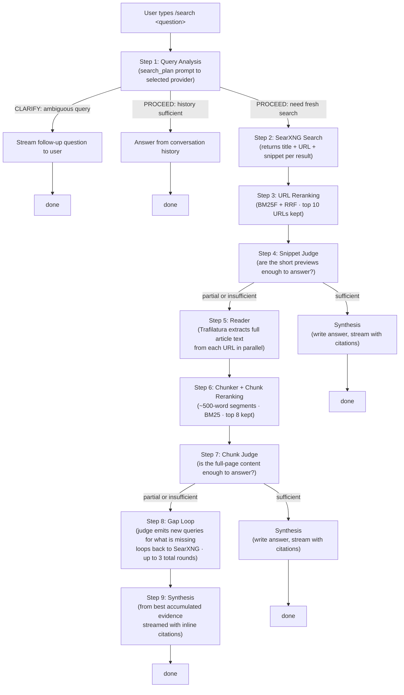

# How Thuki's `/search` Works: A Complete Technical Guide

> **Repository:** [Study Buddy Pro](https://github.com/vindepemarte/study-buddy-pro).

A deep dive into Thuki's agentic RAG search pipeline: how retrieval-augmented generation, iterative reasoning, and local-first infrastructure combine to answer questions from live web sources, entirely on your machine.

---

## Setup

> **Roadmap:** First-class, out-of-box `/search` support (bundled native sidecars or pre-built container images shipped with the app) is planned. Today, enabling `/search` requires running the local Docker services described below. Track progress and contribute in the project's [GitHub issues](https://github.com/vindepemarte/study-buddy-pro/issues).

The `/search` command depends on two local Docker containers: a **SearXNG** meta-search engine and a **Trafilatura** reader. Both run on `127.0.0.1` only, so every query and every fetched page stays on your machine.

**Prerequisites**

- [Docker Desktop](https://www.docker.com/get-started) installed and running.
- [Bun](https://bun.sh) installed (used to launch the Compose stack).
- A local clone of the Study Buddy Pro repository.

**Start the services**

```bash
git clone https://github.com/vindepemarte/study-buddy-pro.git
cd study-buddy-pro
bun install
bun run search-box:start
```

**Verify (optional)**

```bash
curl "http://127.0.0.1:25017/search?q=thuki&format=json"
```

**Stop the services**

```bash
bun run search-box:stop
```

Without these services running, the `/search` command stays disabled in the chat; every other Thuki feature continues to work normally.

---

## The Problem

To understand why `/search` is built the way it is, it helps to understand what simpler approaches get wrong. There are three of them.

### Problem 1: A plain local AI has no access to the internet

When you run an AI model locally on your computer, that model knows only what was in its training data, and that training data has a cutoff date. The model genuinely does not know what happened after its cutoff. It cannot look anything up. Ask it who won a recent championship, whether a software library shipped a fix, or what a company's current pricing is, and it will either admit it does not know or, worse, make something up with confidence.

This is called hallucination, and it is more common in smaller models (like the 2B-parameter models Thuki uses by default) than in the massive cloud models you might be used to. Small models can do a lot of things well, but recalling specific facts they have not seen is not one of them.

The solution is to not ask the model to recall. Instead, retrieve the real information first, then ask the model to reason over it. The model's job changes from "know everything" to "read these sources and write a clear answer." That is a much easier job, and small models handle it well.

### Problem 2: Naive RAG is not enough for hard questions

RAG, or retrieval-augmented generation, is the right idea: retrieve real information from the web, then ask the model to generate an answer from it rather than from memory. Thuki's `/search` is RAG. The problem is with the naive form of it: retrieve once, blindly stuff the top results into the model's input, and generate. This works for simple questions. It breaks down on harder ones for three reasons.

**Search results return snippets, not answers.** Every search engine shows a short preview under each result link. These previews are roughly 150 characters long. That is enough text to tell you a page is probably relevant. It is almost never enough to actually answer a question. Knowing a page mentions "Hedera Governing Council" does not tell you who the members are.

**One search round is rarely enough for complex questions.** A question like "who founded Twitter and who owns it now?" is actually two separate factual lookups. A single search query will surface pages that cover the founding, or the acquisition, but rarely both in enough detail. A single retrieval round leaves the answer incomplete.

**The top results are not necessarily the most useful ones.** Search engines rank results by popularity and click patterns, not by how completely a page answers a specific question. The best source for an answer might be the sixth result, not the first.

### Problem 3: Cloud AI search products solve all of the above, but at a cost

Products like Perplexity, ChatGPT Search, and You.com ARI have built sophisticated systems that handle all of the problems above. They are impressive. But every query you send to them travels to a company's server. For questions about medical conditions, legal situations, unreleased projects, personal finances, or anything else a user would rather keep private, that is a hard constraint.

Thuki's `/search` is built to the same standard as these cloud products, but the retrieval stack runs on the user's machine. If the selected inference provider is Ollama, the LLM planning and answer synthesis stay local too. If the selected inference provider is OpenRouter, the planner, judge, and synthesis prompts are sent to OpenRouter while search aggregation and page reading remain local.

### Thuki's `/search` command: Agentic RAG search pipeline

Thuki's `/search` is **agentic RAG**. It is RAG because it retrieves real web sources and grounds the answer in them. It is agentic because it does not retrieve blindly: it makes decisions at every step. Is the query clear? Is this retrieval sufficient to answer the question? What is still missing? Should it search again with different queries? Each of those questions is answered by the pipeline itself, not hardcoded. The pipeline reasons about its own progress and takes action based on what it finds.

That decision-making loop is what separates agentic RAG from naive RAG, and it is what makes `/search` handle the kinds of questions that stump simpler approaches.

---

## Meet the Three Services

Before walking through the pipeline step by step, it helps to understand the three local services that power it. Each one runs in its own isolated environment on the user's machine. The Rust backend orchestrates all three.

### SearXNG: the meta-search engine

Most people have heard of search engines: Google, Bing, DuckDuckGo. [SearXNG](https://github.com/searxng/searxng) is different. It is a **meta-search engine**, which means it does not have its own index of the web. Instead, it takes a query and sends it to dozens of real search engines simultaneously, collects all their results, merges and deduplicates them, and returns a unified ranked list. SearXNG is the middleman.

When Thuki searches the web, it is not making a direct request to Google or Bing. It is making a request to a locally running SearXNG instance, which then fans out to whichever upstream engines are configured. The user gets the combined coverage of multiple search engines in one call.

**What SearXNG returns:** A JSON list of search results. Each result has three pieces of data:

- A **title**: the headline of the page.
- A **URL**: the link to the page.
- A **snippet**: a short preview of the page content, usually around 150 characters. This is the same short preview text you see under every link in a Google results page.

Snippets are useful for deciding whether a page is relevant. They are almost never enough to answer a question on their own.

**Why SearXNG instead of a commercial search API:** Commercial search APIs (Google Custom Search, Bing Web Search API) require an account and an API key, charge money at scale, and route every query through the vendor's logging pipeline. SearXNG is free and open source, runs in a Docker container the user controls, proxies outbound requests through the container rather than through the user's browser (so upstream engines see the container's requests, not the user's IP or browser fingerprint), and aggregates results from more engines than any single commercial API covers. For a privacy-first local tool, it is the only search backend that fits.

**How it runs:** SearXNG runs in a hardened Docker container bound to `127.0.0.1:25017`. Nothing outside the user's machine can reach it. The configuration file (which controls which engines are enabled and their priorities) is a regular text file in the repository that users can edit without rebuilding.

---

### The Reader: the web page content extractor

A web page in the real world is mostly noise. The article a user wants to read might be 2,000 words, but the HTML file for that page might contain another 10,000 characters of navigation menus, cookie consent banners, advertising scripts, social sharing buttons, related-article widgets, email signup prompts, and footer links. If you feed that raw HTML to an AI, most of what the model sees is garbage.

The Reader's job is to fetch a URL and return only the actual content.

**The technology: Trafilatura.** The Reader is a small Python service (about 90 lines of code) built around a library called [Trafilatura](https://github.com/adbar/trafilatura). Trafilatura is a purpose-built article extraction library. Given an HTML page, it uses a combination of structural analysis (looking at HTML tags and their nesting) and statistical text scoring (identifying blocks of text that look like real prose) to find the main content and discard everything else. The output is clean markdown text: just the article body, ready to feed to an AI.

To illustrate how hard this problem is: a naive approach might try to strip `<nav>` and `<footer>` tags. That fails immediately on modern websites where almost everything is an unstyled `<div>`. Building something that works reliably across millions of different website designs requires years of research and real-world testing. Trafilatura has that history. It is used in production by HuggingFace, IBM, Microsoft Research, Stanford, and the EU Parliament. It scores around 0.95 F1 on the ScrapingHub article extraction benchmark, which is the highest of any open-source library tested.

**What the Reader returns:** For each URL it fetches, the Reader returns:

- A **title**: the page title.
- A **markdown** body: the clean article text with formatting preserved.
- A **status**: either `ok` (content was extracted successfully) or `empty` (Trafilatura could not find any meaningful content, which happens on JavaScript-heavy pages where the text is rendered by the browser rather than present in the HTML).

**Why it runs locally:** When Thuki fetches a page about a user's medical condition, legal situation, or unreleased project, that full page content is extracted by a service running on the user's machine. It never transits a third-party server.

**How it runs:** The Reader runs in a hardened Docker container bound to `127.0.0.1:25018`. The container has all Linux capabilities dropped, a read-only root filesystem, and a strict memory limit. It runs as a non-root system user. A per-URL byte cap (2 MB) and an 8-second fetch timeout prevent any single slow or hostile server from causing problems.

---

### AI provider: OpenRouter or Ollama

The `/search` pipeline uses the inference provider selected in Settings. OpenRouter is the API-first route: Study Buddy Pro sends planner, judge, and synthesis calls to the configured general or reasoning model through OpenRouter's chat-completions API. Ollama remains the local route: it loads a language model (such as Llama, Mistral, Qwen, or Gemma) into the computer's memory and responds to chat requests over a local API.

In the `/search` pipeline, the selected provider is called three times in the typical case:

1. To analyze the query and decide what to do (one call).
2. To judge whether retrieved sources are good enough to answer the question (one or more calls).
3. To synthesize the final answer and stream it back to the user (one call).

**Why two routes:** OpenRouter makes setup fast and lets users choose stronger API models. Ollama keeps the full LLM path local for users who want no API calls. In both modes, SearXNG and the reader remain local services.

---

## The Pipeline, Step by Step

With those three services defined, here is the complete flow for a `/search` invocation. The pipeline is not a straight line. It makes decisions at each step and takes different paths based on what it finds.



Now, each step in detail.

---

### Step 1: Query Analysis

The pipeline's first move is not to search. It is to think about the question.

A single call goes out to the selected inference provider using a system prompt called `search_plan`. The model receives the user's question and the full conversation history from this session. It returns a small JSON object that tells the pipeline exactly what to do next.

```json
{
  "action": "clarify" | "proceed",
  "clarifying_question": "string or null",
  "history_sufficiency": "sufficient" | "partial" | "insufficient",
  "optimized_query": "string or null"
}
```

This one call handles two decisions at once: "Is the query clear enough to act on?" and "Does the conversation already contain the answer?"

**The three outcomes:**

**Clarify.** The query is ambiguous and cannot be reasonably interpreted without more information. Common triggers are pronouns with no antecedent ("tell me more about it" in a fresh conversation), questions whose scope is genuinely unclear, or references to something not yet mentioned. When the model returns `"action": "clarify"`, Thuki streams a follow-up question to the user and stops. No search happens until the user responds.

**Answer from conversation history.** The model returns `"action": "proceed"` with `"history_sufficiency": "sufficient"`. This means the current conversation transcript already contains the answer, so there is no reason to hit the web. For example, if a prior message in the same session already answered "Who is the CEO of Anthropic?", and the user follows up with "What did he study?", Thuki can answer that from context. The pipeline skips all web search and streams a response directly from the conversation history. This is the fastest path.

**Fresh web search.** The model returns `"action": "proceed"` with `"history_sufficiency"` set to `"partial"` or `"insufficient"`. The answer is not in the conversation and needs real web results. The pipeline continues.

The model also returns an `optimized_query`: a rewritten version of the user's question tuned for search engine syntax. A question like "what year did the company that made Photoshop get acquired by Adobe?" becomes something like "Adobe Photoshop acquisition history Altsys 1994" which a search engine handles much better.

**What happens when the model produces invalid output:** Small local models occasionally produce malformed JSON or skip required fields. If the response cannot be parsed, the pipeline retries once with a stricter instruction appended to the prompt. If the second attempt also fails, the pipeline silently falls back to a safe default: proceed with a fresh search using the user's original unmodified query. The user always gets a response.

---

### Step 2: Web Search via SearXNG

With an optimized query in hand, the pipeline sends a request to the locally running SearXNG instance.

SearXNG receives the query and fans it out to all configured upstream search engines in parallel. It collects the results, deduplicates entries that appear in multiple engines, and returns a unified ranked JSON list. Each result carries a title, a URL, and a snippet.

The pipeline receives this list within a 20-second window (SearXNG's total timeout). From this point on, the pipeline has a set of candidate pages. The question is: which of these pages actually contain the answer, and how complete is that answer?

---

### Step 3: URL Reranking

SearXNG returns results ranked by its upstream engines. Those rankings are built for general web traffic: they reflect popularity, authority, and click patterns. For Thuki's purposes, a second ranking pass is applied, one specifically tuned to how relevant each result is to the exact query text.

This step uses two algorithms working together.

**BM25F** (Best Match 25 with Fields) is a keyword relevance scoring algorithm. Given a query and a set of documents, BM25F computes a score for each document by measuring how often the query's words appear in the document, weighted by how rare those words are across all documents. Common words like "the" or "is" score low because they appear everywhere and carry no information. Specific terms like "tokio async runtime" score high because they are rare and directly signal relevance. BM25F extends the base algorithm by letting different parts of a document (here: the title and the snippet) count with different weights. Titles are weighted more heavily than snippets because a matching title is a stronger relevance signal.

**RRF** (Reciprocal Rank Fusion) is a technique for merging two ranked lists into one. Given two orderings of the same set of results, it combines them by computing `1 / (60 + rank)` for each result in each list and summing the scores. The constant 60 is the canonical default used by Elasticsearch and OpenSearch. A result that ranks well in both the BM25F ordering and SearXNG's original ordering gets a high fused score. A result that ranks well on only one signal gets a lower combined score but is not eliminated entirely. The fused ranking balances query-text relevance with engine-authority signals.

After reranking, the top 10 URLs advance to the next stage.

---

### Step 4: The Snippet Judge

Before fetching any full pages (which requires network requests and takes time), the pipeline pauses and asks a question: "Do the short snippets we already have contain enough information to answer this question?"

This is the first judge call. A second call goes out to the selected provider, this time using the `search_judge` system prompt. The model receives the user's original question and all the snippets from the top 10 results. It returns a structured verdict:

```json
{
  "sufficiency": "sufficient" | "partial" | "insufficient",
  "reasoning": "one short sentence explaining the verdict",
  "gap_queries": ["follow-up search 1", "follow-up search 2", "follow-up search 3"]
}
```

**The three sufficiency verdicts, explained plainly:**

**Sufficient.** The snippets already contain the key answer and enough supporting context to write a good response. The pipeline skips directly to synthesis. This is the fast path for simple factual questions where the answer appears prominently in search result previews.

**Partial.** The snippets point in the right direction, but important details are missing: numbers are vague, dates are absent, a comparison only covers some of the relevant options, or the answer is present but without enough context to be useful. This is the most common verdict for entity, event, and comparison questions, because snippets are too short to carry complete information. The pipeline escalates to fetching full pages.

**Insufficient.** The snippets do not actually answer the question. Either the results are off-target, or the answer requires page content that is not visible in the preview. The pipeline escalates to fetching full pages.

When the verdict is partial or insufficient, the model also returns `gap_queries`: a list of up to three specific follow-up search queries targeting exactly what is missing. These are not simple rewordings of the original query. They are new angles targeting the missing information. For a question like "compare Tokio and async-std for Rust async programming," a gap query list might look like:

```
["tokio vs async-std performance benchmark 2025",
 "async-std maintenance status 2025",
 "tokio async-std memory usage comparison"]
```

These queries are stored and used later if the pipeline needs to loop.

---

### Step 5: The Reader (Fetching Full Pages)

When the snippet judge returns partial or insufficient, the pipeline sends the top URLs to the Reader service.

The Reader fetches each page in parallel. For each URL, it makes an HTTP request to the real web page, receives the raw HTML, passes it through Trafilatura's extraction pipeline, and returns clean markdown text of just the article body.

**Why this step matters:** A snippet might say "Tesla was founded in 2003 by a group of engineers who wanted to prove..." and cut off there. The full page continues: "...including Martin Eberhard and Marc Tarpenning. Elon Musk joined as chairman of the board in 2004 and later became CEO." The snippet tells you Tesla was founded in 2003. The full page tells you by whom, and clarifies Musk's actual role. That difference is the difference between a useful answer and a misleading one.

**How the batch fetch works:** The Rust backend fans out requests to the Reader with a 5-slot semaphore (at most 5 pages fetched simultaneously), a per-URL timeout of 10 seconds, and a whole-batch timeout of 30 seconds. A cancellation token threads through every step: if the user closes the overlay while pages are being fetched, all in-flight connections drop immediately.

Pages that return `status: "empty"` (common on JavaScript-rendered sites where Trafilatura cannot extract content because the text is injected by a script after the page loads) are noted and skipped. Pages that fail due to a network error get one automatic retry after a short delay. If all pages in the batch fail to connect, the pipeline falls back to synthesizing from snippets alone.

---

### Step 6: Chunking and Chunk Reranking

A full Wikipedia article or a detailed technical blog post can be tens of thousands of characters long. A small local AI model has a limited context window: there is only so much text it can hold in memory at once and reason over effectively. If the pipeline sent an entire article to the judge or the synthesizer, it would either exceed the model's capacity or overwhelm it with irrelevant sections.

The solution is to split pages into smaller pieces and select only the most relevant ones.

**Chunking.** Each extracted page is split into segments of approximately 500 words. The chunker splits at paragraph boundaries (blank lines in the markdown) when possible, so semantic units stay intact. A paragraph that is longer than 500 words gets split further at word group boundaries. Every chunk carries the URL and title of the page it came from, so that when a chunk is later cited in an answer, the citation links back to the correct source page.

**Chunk reranking.** The chunks from all fetched pages are then ranked by relevance to the user's query. This uses a simpler version of BM25 (single-field, no weighted fields, no fusion with a secondary ranking) because at this point there is only one thing to score each chunk against: the query text. The top 8 chunks are kept. The rest are discarded.

**One chunk per source URL.** Before passing chunks to the next step, the pipeline deduplicates by source URL: if multiple chunks from the same page ranked in the top 8, only the highest-scoring one is kept. This is important for citations. When the final answer says `[3]`, that number should correspond to exactly one distinct web page in the sources list. If the pipeline kept three chunks from the same Wikipedia article, the model might produce `[1]`, `[2]`, `[3]` where all three point to the same page, which is confusing and misleading.

---

### Step 7: The Chunk Judge

With the top chunks in hand, the pipeline makes a second sufficiency judgment. The same judge system prompt is used, but now the model is reading full-page content rather than 150-character snippets. This verdict is much better informed.

**Sufficient.** The full-page content contains everything needed to write a good, grounded answer. The pipeline moves to synthesis.

**Partial or Insufficient.** Even the full pages do not fully answer the question. The judge returns `gap_queries` specifying what is still missing. The pipeline enters the gap loop.

---

### Step 8: The Gap Loop

The gap loop is where the pipeline becomes truly agentic. Instead of giving up when one round of search is not enough, it identifies exactly what is missing and searches for it specifically.

**How a gap round works:** The gap queries returned by the chunk judge (up to three per round) go to SearXNG as new search requests. The results are URLs that have not been seen before in this search session. Those new URLs are deduped against the already-fetched pool, so the pipeline never re-fetches a page it already has. The fresh URLs go through the Reader, then chunking, then chunk reranking, and then the chunk judge again. Evidence accumulates across rounds.

**The round cap.** The pipeline caps at 3 total rounds (the initial round plus up to 2 gap rounds). An uncapped loop on a local model could run for many minutes, and a confused judge could in principle never return "sufficient." The cap is a hard guarantee that the user gets a response within a predictable time window. Three rounds is enough to handle multi-part questions and multi-hop lookups in the vast majority of real-world cases.

**Early exit.** The loop exits before hitting the cap whenever the judge returns "sufficient." A question that needs only one gap round does not pay the cost of two.

**What happens at exhaustion.** If the loop runs all three rounds and the judge still has not returned "sufficient," the pipeline does not error. It takes all the chunks accumulated across all rounds, runs a final reranking pass to pick the best ones, and synthesizes an answer from that material. The answer is marked with a warning in the UI indicating that the pipeline hit its search limit and the answer may be incomplete. A caveated answer is always better than an error message.

---

### Step 9: Synthesis and Streaming

Synthesis is the final step: turning the collected evidence into an answer and streaming it to the user.

**Building the prompt.** The pipeline assembles a message sequence for the selected provider:

1. The synthesis system prompt (`search_synthesis.txt`), which tells the model how to write answers: open with the direct answer, follow with supporting context the reader would naturally want, use inline citations, aim for substance rather than padding. Today's date is injected into the prompt so the model can correctly reason about time-sensitive questions.
2. All completed conversation turns from this session, so the model has conversational continuity.
3. The user's original question.
4. A numbered list of the sources (title, URL, and chunk text for each), presented as reference material.

**How citations work.** The sources are numbered `[1]`, `[2]`, `[3]`, and so on. The synthesis prompt instructs the model to use these numbers as inline citations when it makes a claim: "Tesla was founded in 2003 `[1]`". Before synthesis begins, the pipeline emits a final `Sources` event to the frontend that lists the exact URLs in the exact order they were numbered. This guarantees that when the user sees `[3]` in the answer, source 3 in the sources footer is the page that claim came from.

**Streaming.** The selected provider streams the answer token by token: each word or subword arrives as it is generated and appears in the UI in real time. The user sees the answer build progressively rather than waiting for the entire response to finish before anything appears. If the user closes the overlay mid-stream, the pipeline drops the HTTP connection, emits a cancellation event, and discards the partial response without saving it.

**Substance, not length.** Small local models tend to produce very short answers when left to their own devices. The synthesis prompt explicitly pushes against this. For questions about people, the model is instructed to include their role, their notable work, and relevant facts. For companies, the founding year and what they do. For events, when, where, and why they matter. For processes, the key steps. For comparisons, the dimensions that actually differentiate the options. Two to four tight paragraphs with real information is the target, not a one-liner that technically answers the question but leaves the reader with follow-up questions.

---

## Privacy by Design

Every step in the pipeline that involves AI processing, content extraction, or search aggregation runs on the user's machine. Here is exactly where data goes at each stage:

**Query text:** The user's question goes to the selected inference provider for routing, judging, and synthesis. In Ollama mode, that provider is the local Ollama instance. In OpenRouter mode, those LLM prompts are sent to OpenRouter. The query also goes to the local SearXNG instance for search (Step 2).

**Web search requests:** SearXNG sends queries to upstream engines (Google, Bing, DuckDuckGo, etc.). These requests originate from the SearXNG container running on the user's machine, not from the user's browser, so upstream engines see the container's requests rather than the user's browser fingerprint or IP address.

**Fetched page content:** The Reader fetches pages directly from the web. The content of those pages is processed entirely on the user's machine by Trafilatura. The text of a medical article, a legal document, or an internal project page never transits any third-party server between the original web host and the user's machine.

**Conversation history:** Stored locally. Never transmitted anywhere.

No telemetry. The Ollama route needs no API key or account. The OpenRouter route uses the locally stored API key only for the model calls the user selected.

---

## Five Design Decisions Worth Understanding

The pipeline's shape reflects specific technical choices. Here is the reasoning behind each one.

### Why SearXNG instead of a commercial search API

Commercial search APIs (Google Custom Search, Bing Web Search API) require accounts, have rate limits, cost money at scale, and send every query through the vendor's logging infrastructure. SearXNG is free, open source, self-hosted, and aggregates far more engines than any single commercial API. It fits the privacy-first constraint because the user controls the instance entirely. There is no vendor relationship, no usage cap, and no query data leaving the user's machine to reach a search company.

### Why Trafilatura instead of a headless browser for content extraction

A headless browser (Playwright, Puppeteer) can render JavaScript-heavy pages, which Trafilatura cannot. That sounds like a clear win for the browser. But headless browsers add enormous overhead: Chromium is hundreds of megabytes, browser startup takes seconds per page, and memory usage is an order of magnitude higher than a Python HTTP client. For the large majority of article-style pages, Trafilatura extracts content just as well and does it in milliseconds without any browser infrastructure. JavaScript-rendered pages that return empty are a known limitation, tracked per URL in the pipeline's metadata. If enough real-world queries are consistently failing due to JS rendering, adding a browser-backed fallback layer is a straightforward future addition. But adding it speculatively would make the system significantly heavier without benefiting most users.

### Why BM25 instead of vector embeddings for reranking

Vector embedding reranking (used by modern semantic search systems) works by converting each chunk of text into a list of numbers (a vector) that represents its meaning, and then measuring which vectors are closest to the query vector. It captures meaning, not just keyword matches, which is a real advantage for vague or paraphrased queries.

The problem is that generating vectors requires running an embedding model, which takes time and resources. Thuki is already running one local model (Ollama). Adding a second model specifically for embeddings adds infrastructure complexity and latency. BM25 is deterministic, requires no model, runs in microseconds, and performs comparably to embedding-based rerankers for the keyword-rich search queries that `/search` handles. If retrieval quality becomes a measurable problem, swapping in an embedding-based reranker is a clean future upgrade. The pipeline seam is already in place.

---

_That covers the full pipeline: from the moment the user types `/search <question>` to the moment the last token of the answer appears on screen. Every component, every decision point, every design trade-off. The whole system runs locally. The search is real. The privacy is genuine._
